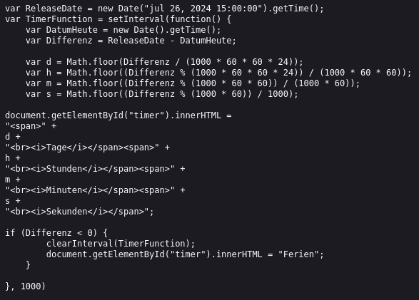

# Programming Basics - JavaScript - Tag 3 (di8jul24)

### Übungen gestern, Operatoren, Tutoring; Caroline hat eigene Version vom Countdown geschrieben:

https://caroline-reichart.github.io/Feriencountdown/timer.js

- 

### recap gestern:

- basic operators 

- gleich: logische operators

- Frage: Math.random()

## Math.random()

- keine weitere Angaben:

=> output ist random number zwischen 0 und 1

```javascript
Math.random() * 10

```
=> output zwischen 0 und 9

```
Math.random() * 11 
``` 
<!-- eigentlich [10+1] -->

=> geht bis 9.999999

Dezimalen weg: 
```javascript
Math.floor(Math.random() * 10)
```

- real-life Anwendungsbeispiele: 
- Authentication
- password generator random.org / random password generator / Bcrypt Hash Generator & Verifier
- Animationen


abc123 - generate Hash - 2. verify Hash 

#
#
## Üben im Unterricht

```javascript
let age = 44;
//age = age +1;
//age += 1;
//age + 1;
age ++;//plus 1
age = age + 2;
//genauso gut ist age += 2;

console.log(age);
```
- -output console:

44 + 1 + 2 = 
```console
47
```


## Beispiel ++ und -- bei Bestellung

```javascript
let pizzaPrice = 10;
let pizzaCount = 0;
pizzaCount ++;
pizzaCount ++;
pizzaCount --;


console.log(`pizza price is : ` , pizzaCount * pizzaPrice);
```

### für größere Inkrementen

```javascript
let num = 2
num += 5; // num = num * 5
num /= 2; // num = num / 2
console.log(num); 
//reset num : num = 0
```
- console:
2 * 5 / 2 = 
```console
5
```

## Vergleichoperatoren


```javascript
let age2 = 50;
console.log(age2 == 51);// false 
console.log(age2 == 50 , age2 == "50");// beide true. 
//PROBLEM Gleichheit

```

### Strenge Gleichheit === (value, data type);
dies bedeutet, dass nicht nur die Wert (50), sondern auch der data type (string / number / boolean / ...) gleich.

```
// = anweisung

// == wert

// === wert UND datentyp
```

```javascript
console.log("2 === 5 : ", 2 === 5);
console.log("Hello" === "hello"); // false
console.log("hallo" === "hallo");// true

let userPassword = "abcd124";
let userInput = "abcd1234";
if(userPassword === userInput){
    console.log(`password correct`);
}
//user Eingabe ist eigentlich immer bei default "string"

```

### ungleichheit !=

```javascript
console.log("2" != 2); // false; der Wert ist gleich
console.log("2" !== 2); // true; wert ist zwar gleich aber typ ungleich

if(userInput !== userPassword){
    console.log('password not correct');
}
```
    console.log(!true); // not true // false
    console.log(!false); // not false // true
    // != not equal
    // == equal
    // === equal

## Größer (>)  / kleiner als (<)

```javascript
// ### Größer als >

console.log(" ---");
console.log(5 > 7); // false
console.log(7 > 5); // true
// let name = "Maximilian"; 
let name = "Max"; // name LENGTH = 3
console.log(name.length > 5);
```
- console:
    ```console
    ---
    false
    true
    false
    ```

## Kleiner als oder gleich:

```javascript
let driverAge = 70;
driverAge ++; // 71
driverAge -= 2; // 69
console.log("driverAge <= 70 " , driverAge <= 70);
console.log(" --- ");

//Größer als oder gleich
driverAge = 18;
console.log("driverAge: ", driverAge," >= 18",driverAge >= 18);

let password = "abcd1234";
console.log(password.length, " >= 8", password.length >= 8);
```

- console:

    ```console
    driverAge <= 70  true
    --- 
    driverAge:  18  >= 18 true
    8  >= 8 true
    ```


